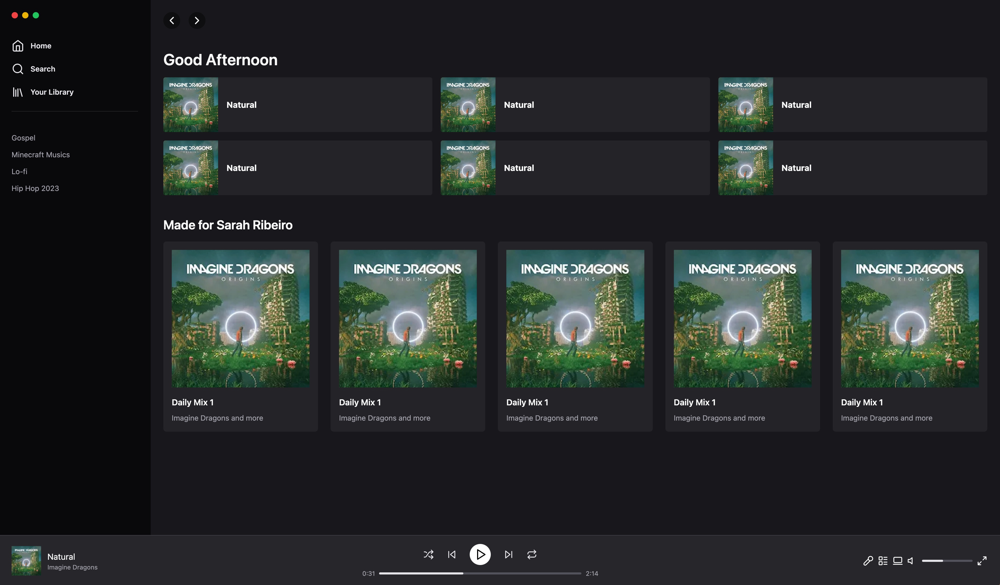

<h1 align="center"> Clone Spotify Tailwind CSS </h1>

Um clone do Spotify criado usando Tailwind CSS e NextJS, seguindo o projeto da Rocketseat.  

  <a href="#-tecnologias">Tecnologias</a>&nbsp;&nbsp;&nbsp;|&nbsp;&nbsp;&nbsp;
  <a href="#-projeto">Projeto</a>&nbsp;&nbsp;&nbsp;|&nbsp;&nbsp;&nbsp;
  <a href="#memo-licença">Licença</a>

  

 

  

## 🚀 Tecnologias

Esse projeto foi desenvolvido com as seguintes tecnologias:

- NextJS
- Tailwind CSS
- Git e Github
- Typescript

## 💻 Projeto

Um clone do Spotify criado usando Tailwind CSS e NextJS, seguindo o projeto da Rocketseat.

Link para o vídeo usado como base para criação do projeto: https://youtu.be/YVI-q3idGiM

## :memo: Licença

Esse projeto está sob a licença MIT.

---

Feito com ♥ by Sarah Ribeiro
